# F1 Data Analysis — Veliki Podaci Projekat

Ovo je projekat za predmet Veliki Podaci, u kom sam napravio mali sistem koji simulira kako bi
izgledala obrada F1 telemetrije u (skoro) realnom vremenu. Podaci dolaze sa 
[OpenF1 API-ja](https://openf1.org), glavni deo projekta je Austrijska trka iz 2024, a za jednu
bonus analizu sam dodao još par staza (Monako, Monza, Meksiko, Brazil) da uporedim koliko sama
staza utiče na brzinu.

Ideja je sledeća: podatke prvo skinem i sredim, pa ih FastAPI servis pušta kao stream (kao da se
trka odvija uživo), Kafka producer/consumer to prosleđuju i snimaju, Spark Structured Streaming
čita te podatke u malim komadima i pravi agregacije u hodu, a na kraju u Databricks-u imam 6
analiza (regresija, t-test, Mann-Whitney U test, klasterovanje, RandomForest model, predikcija
pretica) sa objašnjenjima i grafikonima. Uz sve to ide i mali live vizualizator u matplotlib-u
da se vidi kako formule uživo prolaze kroz stazu.

## Kako to izgleda

**Live vizualizator** — dok Kafka producer pušta podatke, ovo se crta uživo: traka, kola u boji
tima, i panel sa brzinom/gasom/kočnicom/gap-om/gumom za svakog vozača:

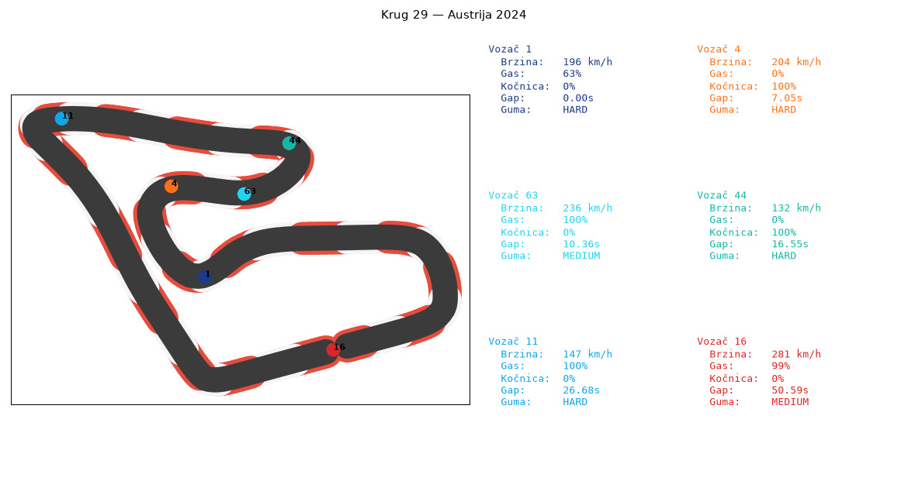

**Analiza 1 — Degradacija guma po tipu (linearna regresija):**

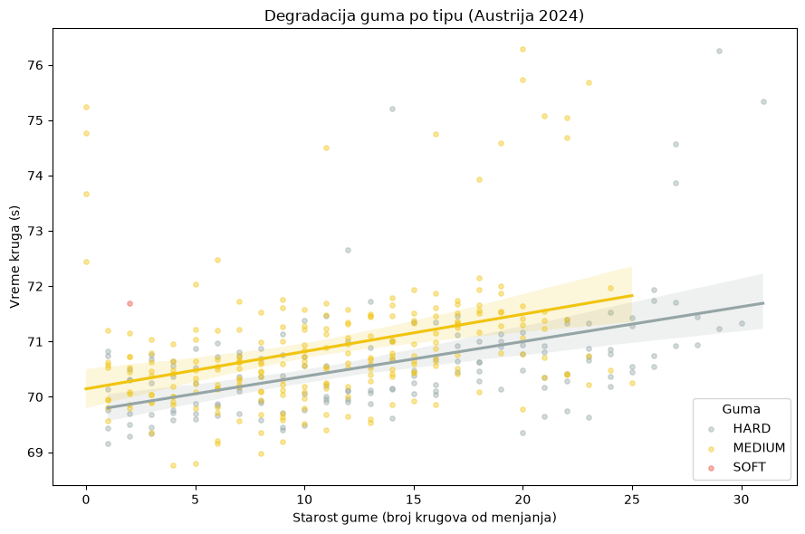

**Analiza 2 — Tempo pre/posle pit stopa:**

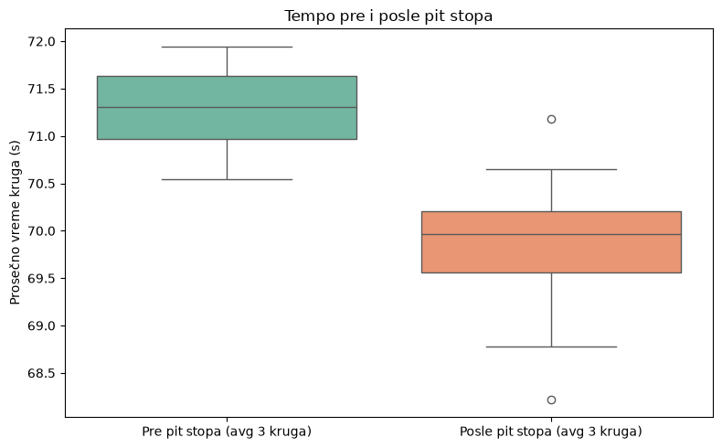

**Analiza 3 — VER vs NOR: raspodela tempa i telemetrija kroz isti krug:**

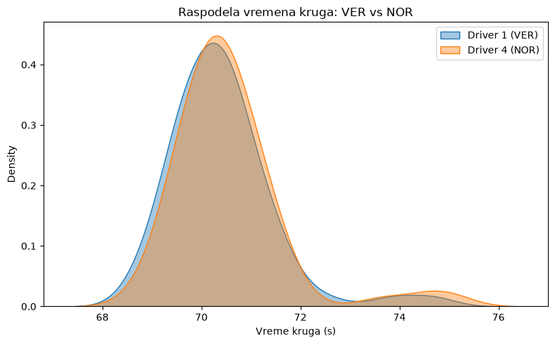
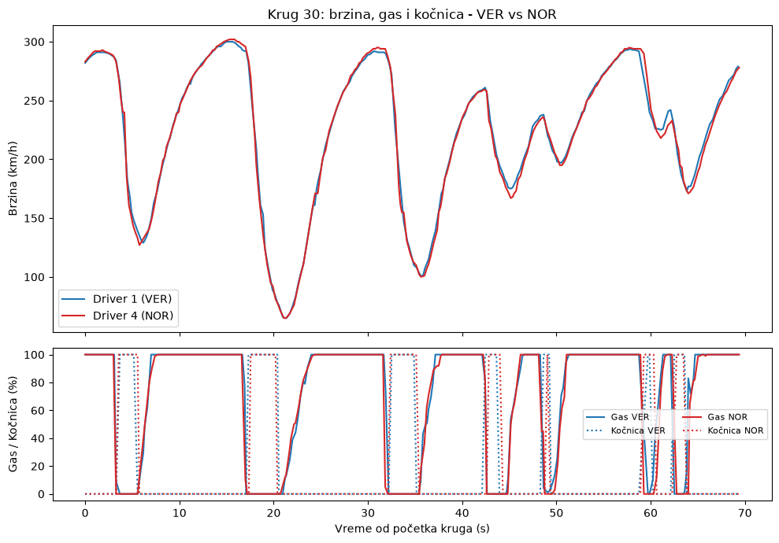

**Analiza 4 — Korelacija telemetrije, uticaj vremena, brzina/RPM po brzini prenosa, klasteri stila vožnje:**

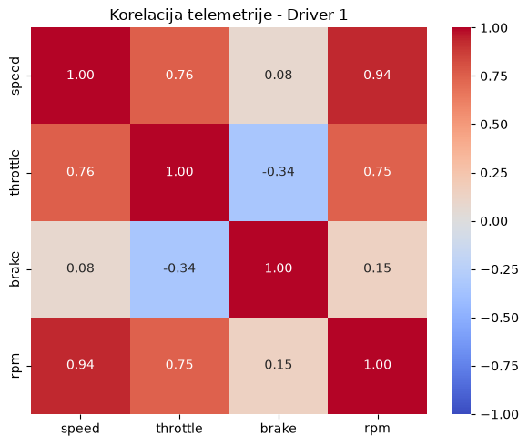
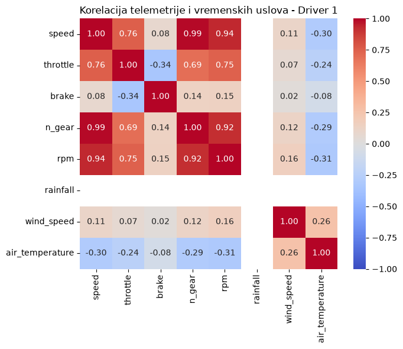
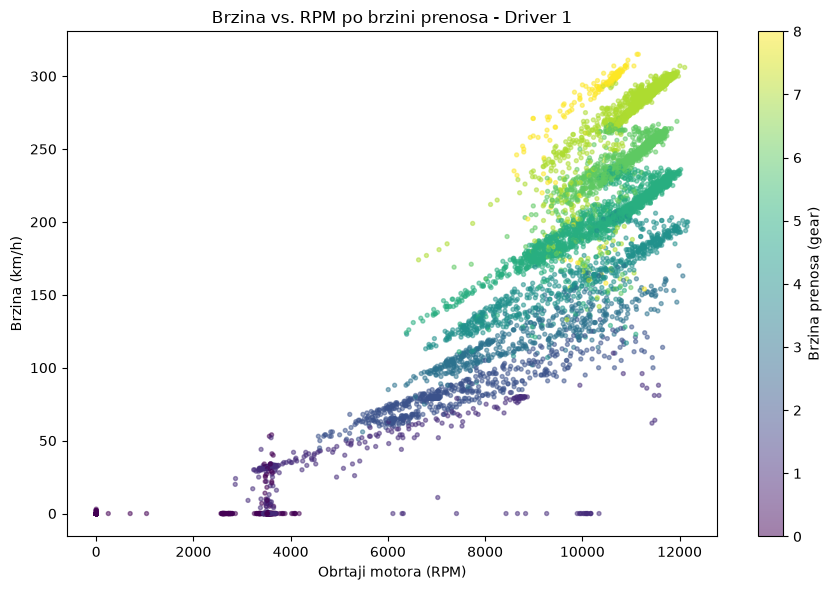
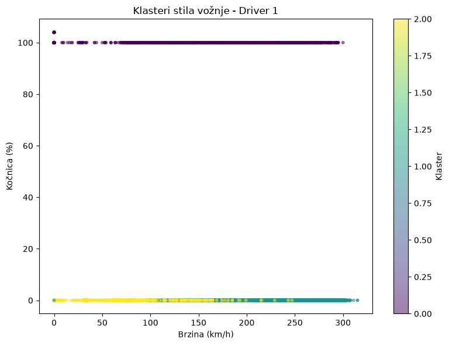

**Analiza 5 — Predikcija vremena kruga (RandomForest):**

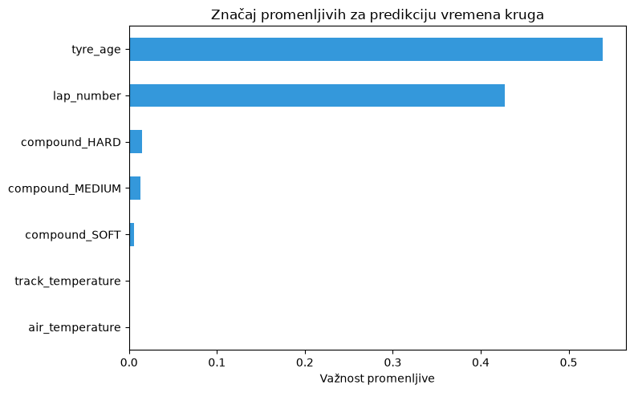
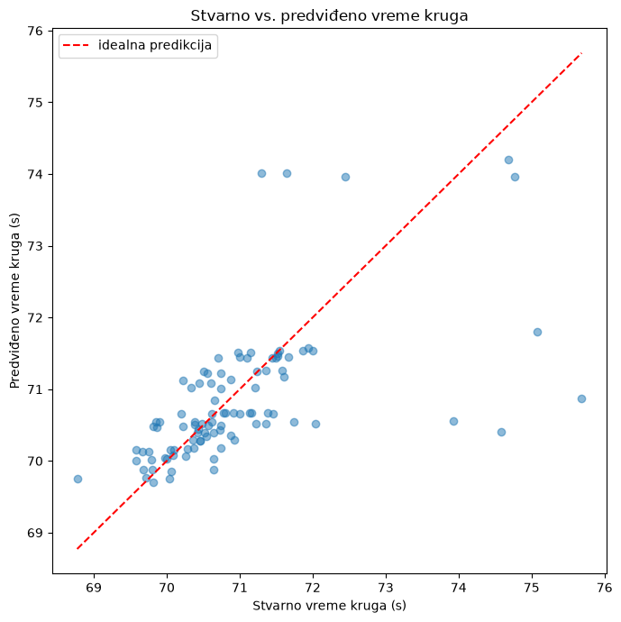

**Analiza 6 — Predikcija pretica (regresija nad razmakom do vozača ispred):**

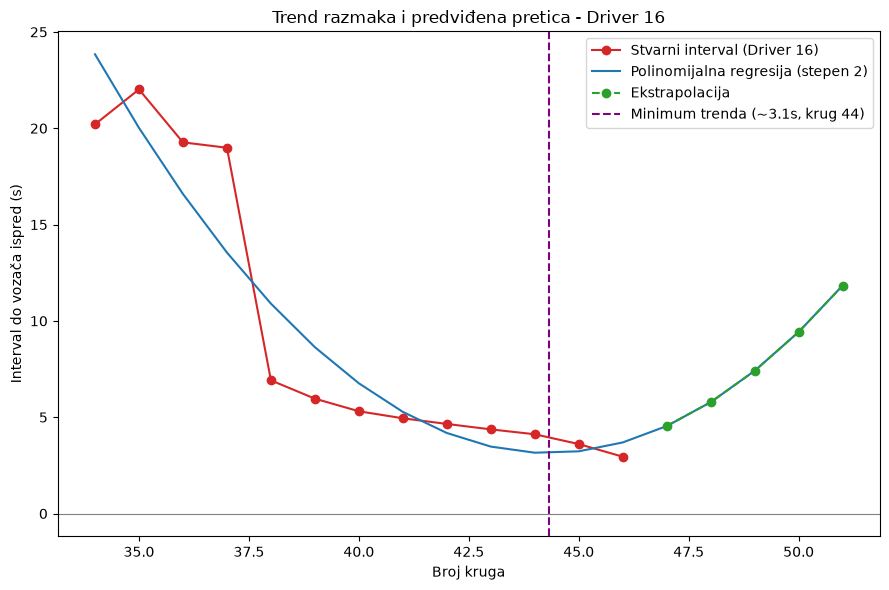

**Bonus — poređenje 5 staza (oblik + prosečna/max brzina, ANOVA):**

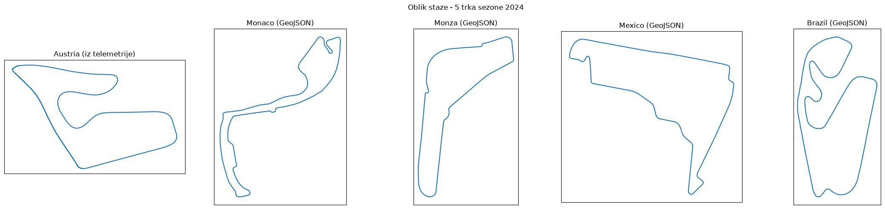
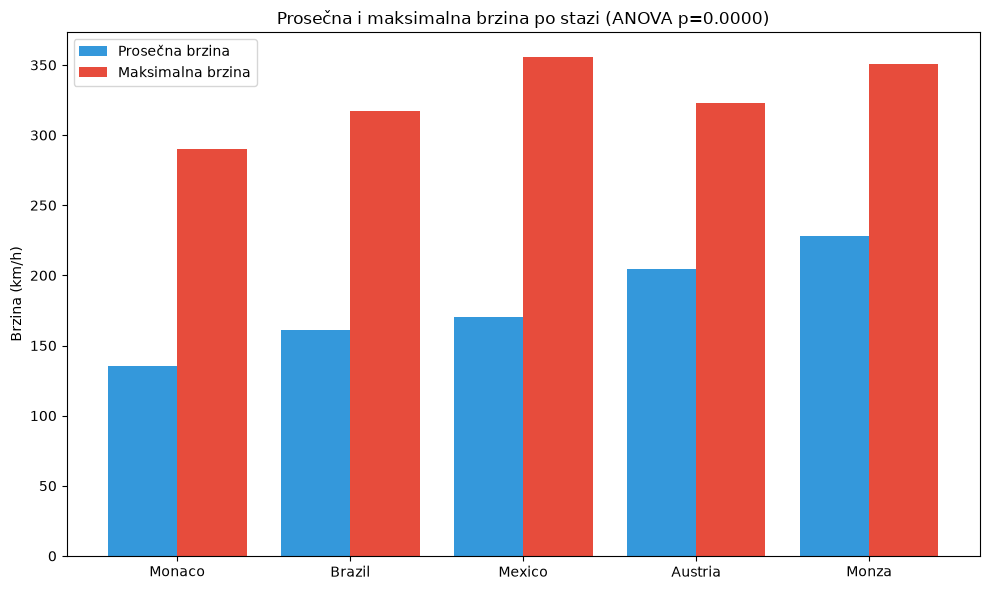

## Kako pokrenuti

Redosled je bitan — prvo se skidaju i sređuju podaci, pa tek onda sve ostalo.

```bash
python3 -m venv .venv && source .venv/bin/activate
pip install -r requirements.txt

python3 scripts/collect_data.py
python3 scripts/combine_interpolate.py
python3 scripts/generate_streaming_chunks.py
```

**FastAPI:**
```bash
cd api && uvicorn main:app --reload --port 8000
```

**Kafka (potreban Docker):**
```bash
cd kafka && docker compose up -d
python3 kafka/producer.py --endpoint full --topic f1-full
python3 kafka/consumer.py --topics f1-full
```

**Live vizualizator:**
```bash
python3 kafka/visualizer.py --topic f1-full
```

**Spark Streaming:**
```bash
python3 spark/streaming_job.py
```

**Databricks notebook-ovi** su u `databricks/01`–`08` (i `.ipynb` i `.html`), već pokrenuti sa
pravim rezultatima. Za upload na Databricks samo treba zameniti `DATA_DIR`/`CHUNKS_DIR` putanje
na vrhu svakog notebook-a odgovarajućom DBFS putanjom.
